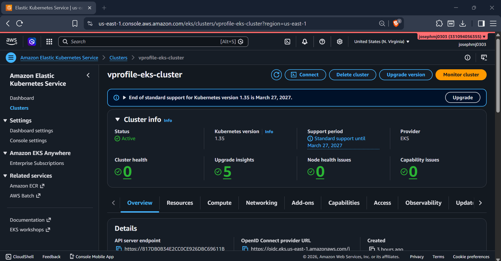
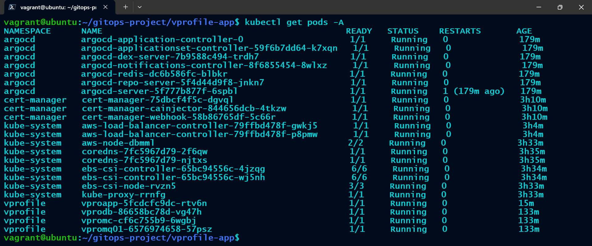

# VProfile GitOps Infrastructure


Terraform Infrastructure as Code repository used to provision and manage AWS resources required for the VProfile GitOps platform.

---

## Repository Navigation

| Repository | Description |
|------------|-------------|
| vprofile-app | Main project repository |
| vprofile-gitops | Helm charts and GitOps configuration |
| vprofile-gitops-infra | Terraform infrastructure |

---

## 🚀 Architecture


---

## 📌 Project Overview

This repository provisions the AWS infrastructure supporting the VProfile GitOps platform.

Infrastructure is deployed using Terraform and includes networking, compute, Kubernetes services, IAM integration, and ingress management.

### Key Features

* AWS EKS provisioning with Terraform
* Managed Node Groups
* IAM Roles for Service Accounts (IRSA)
* AWS Load Balancer Controller
* ArgoCD Installation
* Kubernetes Storage Integration

---

## 📂 Repository Structure

```text
.
├── README.md
├── .gitignore
├── docs/
│   └── images/
│       ├── architecture-diagram.png
│       ├── eks-cluster.png
│       └── pods-running.png
├── argocd-ingress.yaml
├── iam_policy.json
└── terraform
    ├── backend.tf
    ├── main.tf
    ├── outputs.tf
    └── variables.tf
```

---

## 🖥️ Infrastructure Components

### AWS Resources

* VPC
* Public & Private Subnets
* Internet Gateway
* Route Tables
* Amazon EKS Cluster
* Managed Node Group
* IAM Roles & Policies

### Kubernetes Components

* AWS Load Balancer Controller
* EBS CSI Driver
* Cert Manager
* ArgoCD

---

## 🔄 Deployment Workflow

1. Terraform provisions AWS infrastructure
2. EKS cluster becomes available
3. IRSA is configured
4. AWS Load Balancer Controller is installed
5. ArgoCD is deployed
6. GitOps repositories are connected

---

## 📸 Screenshots

### AWS EKS Cluster



### Running Kubernetes Workloads



---

## ⚙️ Technologies Used

* Terraform
* AWS EKS
* IAM
* IRSA
* AWS Load Balancer Controller
* Cert Manager
* ArgoCD
* Kubernetes

---

## 📂 Related Repositories

| Repository      | Purpose                            |
| --------------- | ---------------------------------- |
| vprofile-app    | Application Source Code & CI/CD    |
| vprofile-gitops | Helm Charts & GitOps Configuration |

Main Project:

https://github.com/josephmj0303/vprofile-app

---

## 🧠 Results

* Infrastructure fully managed as code
* Repeatable EKS deployments
* Secure IAM integration with IRSA
* Automated ingress provisioning using ALB

---

## 📈 Future Enhancements

* Terraform Remote Backend
* Multi-Region Deployments
* Cluster Autoscaler
* Karpenter Integration
* Monitoring Stack (Prometheus & Grafana)

---

## 👨‍💻 Author

Joseph MJ

DevOps Engineer | AWS | Terraform | Kubernetes
